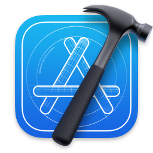

# Tooling

    <a href="https://www.apple.com/macbook-pro-13/" class="icon">
        <i data-tippy-content="macOS Big Sur" class="fab fa-2x fa-apple"></i>
    </a>
    
    
    
    
    
    
    
    
    
    
    

# Services

    <a href="https://github.com/qkdreyer/" class="icon">
        <i data-tippy-content="GitHub" class="fab fa-2x fa-github"></i>
    </a>
    

# Languages

- [PHP](https://www.php.net/) ([Symfony](https://symfony.com/))
- [Node.js](https://nodejs.org/) ([Express](http://expressjs.com/))
- [JavaScript](https://developer.mozilla.org/en-US/docs/Web/javascript) ([Vue.js](https://vuejs.org/), [React](https://reactjs.org/))
- [Shell](https://en.wikipedia.org/wiki/Shell_script)
- [Haxe](https://haxe.org/)
- [C++](https://fr.wikipedia.org/wiki/C%2B%2B) ([Qt](https://www.qt.io/))
- [Ruby](https://www.ruby-lang.org/)
- [Python](https://www.python.org/)
- [Swift](https://www.apple.com/fr/swift/)
- [Objective-C](https://fr.wikipedia.org/wiki/Objective-C)
- [Java](https://www.java.com/)
- [SQL](https://fr.wikipedia.org/wiki/Structured_Query_Language)

# Projects

- [Githubers](https://githubers.qkdreyer.dev/?repos=vuejs/vue&repos=vuejs/vuex)

